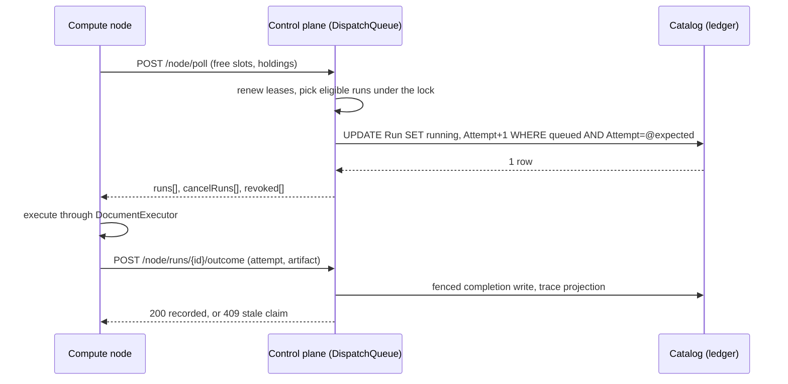

# Run Dispatch Inside the Control Plane

Status: all three phases shipped on `main` on 2026-09-11 (phase 1: the queue moved into the control plane, the node protocol, the ownership lease, the tests; phase 2: the execution spec in every hand-out, the flow-version, context and trace calls, `SqlFlow.Node` without a catalog reference, `--db` gone from `sqlflow worker`; phase 3: the scale-target endpoint and the KEDA `metrics-api` rules replacing the mssql scaler and its catalog secret, the GUI dispatch panel, the wiki decision page). Written the same day against the code on `main` before the change, so "today" in sections 2 and 3 means the state this design replaced. Three decisions changed during implementation: the break-glass `sqlflow runs cancel --db` path stays (the dispatcher's reconcile makes a direct catalog cancel safe, so removing it would have cost an operator a tool for nothing); the node registry is kept in memory and flushed to the catalog on a cadence rather than written per heartbeat, for the fleet-size target in section 4.11; and the watermark table and landing-reset verdict are not resolved at hand-out time but on a separate context call the node makes after parsing the document, because only the parsed document says whether the flow participates and the control plane cannot parse every run's document (a pinned run without a snapshot is materialized from git on the node). A fourth followed in phase 3: the scale target lives under the node route prefix (`GET /api/v1/node/scale-target?pool=`, since the default pool's key is empty and cannot be a route segment, and so that it shares the node policy and rate-limit partition) and is computed from the journal on every replica rather than from the owner's memory, so an autoscaler behind a load balancer never depends on which replica it reached.

## 1. The decision

The run queue moves out of SQL Server and into the control plane process. The control plane keeps the whole dispatch state in memory (what is queued, what is leased to which node, which gates block what), makes every dispatch decision under one lock, and hands work to compute nodes that pull it over HTTP. The shadow catalog stops being the queue and becomes the journal: it is written through with plain, provider-neutral updates so runs survive a restart and stay visible in the GUI, and it is read only at startup and by a periodic reconcile.

What this removes:

- The single-statement claim with `UPDLOCK, READPAST, ROWLOCK` and the `SET TRANSACTION ISOLATION LEVEL` prelude in `src/SqlFlow.Catalog/RunQueueStore.cs` and `ComputeTaskStore.cs`, the raw `Microsoft.Data.SqlClient` command path, and the `SqlException` error-number matching (2601/2627) that turns a lost pipeline race into a retry.
- The reliance on the filtered unique index `UX_Run_RunningPipeline` as the pipeline-serialization guarantee.
- Direct catalog connections from every compute node. Today `sqlflow worker` takes `--db` and claims, heartbeats, polls cancels, recovers orphans, and records outcomes straight against the database (`src/SqlFlow.Node/RunWorker.cs`, `src/SqlFlow.Cli/Program.cs`).
- The KEDA `mssql` scaler and its second, Go-driver-shaped connection string secret (`deploy/bicep/main.bicep`, `deploy/bicep/worker.bicep`, `deploy/k8s/worker-pool.yaml`), whose SQL query duplicates the claim's gating predicates and must be kept in step by hand.
- The liveness reaper's polling sweep (`src/SqlFlow.ControlPlane/Background/OrphanRunReaper.cs`) and the node's name-based startup recovery, both replaced by leases.

What this keeps, because it is the design and not the implementation: FIFO by enqueue time, pool routing, wave ordering inside a run group, the group concurrency cap, one running execution per pipeline, the attempt counter as a fencing token, the three-attempt poison bound, cancel-of-queued versus cancel-of-running, skipping dependents on failure, drain-on-stop, restart requests, the busy signal for autoscaling, and a run being visible in the GUI from the moment it is enqueued.

## 2. What exists today

The trigger endpoint and the scheduler both enqueue through `IRunDispatcher` (`src/SqlFlow.ControlPlane/Background/RunDispatcher.cs`). The only implementation writes a `queued` row into `catalog.Run` and releases a one-slot semaphore (`RunQueueSignal`) so the in-process worker re-drains at once. A standalone worker never sees that signal; it polls the table every `--poll-seconds` (default 5).

`RunWorker.DrainAsync` takes a concurrency slot, opens a catalog scope, and calls `RunQueueStore.ClaimNextAsync`. The claim is one T-SQL statement that evaluates four gates inside the `SELECT TOP (1)`: pool eligibility, no lower-wave sibling still queued or running, fewer running siblings than `GroupMaxConcurrency`, and no running run of the same pipeline. The pipeline gate is only advisory under `READ COMMITTED` (two nodes can both pass it), so the filtered unique index is what actually enforces it, and the loser's duplicate-key error is caught and retried up to three times. The group concurrency gate is documented as "about this many" because a multi-node fleet can overshoot it.

Liveness is a heartbeat row (`catalog.Node`, `NodeStore.HeartbeatAsync`, every 15 seconds from `RunWorker.HeartbeatLoopAsync`). The control plane's `OrphanRunReaper` sweeps every 30 seconds for running rows whose node has not heartbeated in 180 seconds and requeues, fails, or cancels them (`RunQueueStore.ReapOrphanedRunningAsync`). Cancellation of a running run is a stamped `CancelRequestedUtc` that the owning node discovers by polling `ListCancelRequestedAsync` on every loop iteration.

The control plane is deployed with ingress autoscaling from one to three replicas (`deploy/bicep/main.bicep`). Cross-replica coordination is compare-and-swap in the catalog: `ScheduleStore.TryClaimFireAsync` for schedule fires, `RepoSourceStore.TryClaimSyncAsync` for git sync, and idempotent conditional updates in the reaper.

Beyond the queue itself, a node also reads the catalog during execution: the run row joined to repo, pipeline, and repo source; the snapshotted YAML in `FlowVersion`; lineage tables for the downstream watermark table and the landing-reset verdict (`ResolveDownstreamWatermarkTableAsync`, `ResolveLandingResetAsync`); and it writes `RunStatement` and `RunEvent` rows live through `CatalogRunStatementSink` and `CatalogRunEventSink`. Those touchpoints are not the queue, but they are why a node cannot yet run with only a control-plane URL, and the plan covers them in phase 2.

Compute tasks (`catalog.ComputeTask`, `ComputeTaskStore`) are a second copy of the same pattern with a simpler gate set and lazy expiry on the read path.

## 3. Invariants the new design must hold

These are the semantics the existing store and its tests encode (`tests/SqlFlow.ControlPlane.Tests/RunQueueStoreTests.cs`, `RunGroupQueueTests.cs`, `ComputeTaskStoreTests.cs`, `RunWorkerDrainTests.cs`). The new engine is measured against them before the old path is deleted.

1. Two nodes never execute the same run, and two runs of one pipeline never execute concurrently.
2. A run group member becomes eligible only when every lower-wave member is terminal; at most `GroupMaxConcurrency` members of a group execute at once. The cap becomes exact, not approximate.
3. Eligible runs are handed out oldest first within a pool; an ineligible run never blocks a later eligible one.
4. Every hand-out increments `Attempt`; every outcome write is conditional on (node, attempt) and a stale write is dropped and reported.
5. A run whose node disappears is requeued, or failed after `MaxExecutionAttempts` (3) hand-outs, or recorded cancelled when a cancel was already pending; a failed or cancelled member skips its still-queued dependents.
6. Cancelling a queued run removes it before any node sees it; cancelling a running run reaches the node without waiting for a poll interval.
7. A stopping node keeps its work, finishes it, and is never mistaken for a dead one while it drains.
8. Enqueue is durable before it is acknowledged, and a control-plane restart loses nothing queued or running.
9. The API and GUI keep reading run state from the catalog exactly as they do now.

## 4. Target architecture

### 4.1 Components and ownership

| Component | Lives in | Owns |
| --- | --- | --- |
| `DispatchState` | new project `src/SqlFlow.Dispatch` (no EF, no ASP.NET, no I/O) | The in-memory state, the gates, the eligibility scan, leases, long-poll waiters. Pure and deterministic under an injected `TimeProvider`. |
| `IDispatchLedger` | interface in `SqlFlow.Dispatch`, implemented in `SqlFlow.Catalog` by the rewritten `RunQueueStore` and `ComputeTaskStore` | The durable journal: insert queued, mark handed out, record outcome, requeue, fail, cancel, skip dependents, load snapshot. Plain EF conditional updates only. |
| `DispatchService` | `src/SqlFlow.ControlPlane/Dispatch/` | Hosts the queue: acquires the dispatch lease, rebuilds from the ledger, runs reconcile and lease-expiry ticks, exposes the queue to the API and to the node endpoints. |
| Node protocol | contracts in `SqlFlow.Dispatch.Protocol`; endpoints under `/api/v1/node/*` in the control plane; `HttpNodeTransport` in `SqlFlow.Node` | The only way a node obtains or reports work. |
| `INodeTransport` | `SqlFlow.Node` | The seam under `RunWorker`: `HttpNodeTransport` for `sqlflow worker`, `InProcessNodeTransport` for the control plane's own worker. One drain loop, two transports. |

`SqlFlow.Node` stops referencing `SqlFlow.Catalog` at the end of phase 2. `SqlFlow.ControlPlane` references `SqlFlow.Dispatch`; `SqlFlow.Dispatch` references nothing but `SqlFlow.Core`.

### 4.2 The in-memory queue

State, all mutated under a single `System.Threading.Lock`:

```text
runs            Dictionary<Guid, Entry>                  every queued or leased run
queuedByPool    Dictionary<string, SortedSet<Entry>>     ordered by (EnqueuedUtc, RunId); "" is the default pool
runningPipeline HashSet<Guid>                            the pipeline gate
groups          Dictionary<Guid, GroupState>             per wave: non-terminal count; running count; cap
leases          Dictionary<Guid, Lease>                  runId -> (node, attempt, expiresUtc)
leaseExpiry     PriorityQueue<Guid, DateTime>            next expiry first
waiters         per pool, a list of pending long-poll completions
```

An entry carries exactly the columns the claim SQL reads today: `RunId`, `PipelineId`, `TargetPool`, `GroupId`, `GroupWave`, `GroupMaxConcurrency`, `EnqueuedUtc`, `Attempt`, `CancelRequested`.

Eligibility of an entry for a node request is three constant-time checks: the pool is null or in the node's pool list; `runningPipeline` does not contain its pipeline; and, for a group member, its wave is the group's lowest non-terminal wave and the group's running count is below its cap. The hand-out scan walks the node's eligible pools' sorted sets in enqueue order and stops when it has filled the node's free slots. The scan is linear in the number of queued entries for those pools, with hash lookups per entry, which at tens of thousands of queued runs is still sub-millisecond; the state is a few hundred bytes per entry.

A node request may receive several runs in one response (up to its reported free slots), so a fleet that scales up drains a backlog in one round trip per node instead of one claim per run.

### 4.3 Durability: the ledger contract

Memory is authoritative for dispatch decisions; the catalog is the journal. The rules that keep them consistent:

- Enqueue is ledger-first. The API inserts the `queued` row exactly as today (with the commit pin and the YAML snapshot), then adds the entry to the queue and wakes the pool's waiters. An enqueue that reaches the ledger but not the queue (a crash in between, or a passive replica, see 4.5) is picked up by reconcile.
- Hand-out is reserve, write, confirm. Under the lock the scan marks entries as reserved for the node and releases the lock. The ledger write is `UPDATE Run SET Status = running, ClaimedByNode, StartUtc, Attempt = @expected + 1 WHERE RunId = @id AND Status = queued AND Attempt = @expected`, one row per run, portable and exact because memory already knows `Attempt`. A write that affects zero rows means the ledger disagrees (the row was cancelled or removed directly), so the entry is dropped from memory. A thrown write returns the entry to queued. Only runs whose write succeeded are handed to the node, so the ledger is never behind what a node holds.
- Outcome is fenced. `complete`, `fail`, and `cancelled` collapse into one ledger operation guarded by `Status = running AND ClaimedByNode = @node AND Attempt = @attempt`; zero rows affected is reported to the node as a stale claim. The artifact projection (`CompleteFromArtifactAsync` and its trace re-projection) keeps its body; only the guard and the call site move.
- Rebuild at startup loads every `queued` and `running` row into memory. Running rows get a grace lease equal to the lease TTL so a node still executing them can reattach on its next poll; if nobody reattaches the lease expires and the normal disposition applies. A control-plane restart is therefore invisible to nodes and loses no work.
- Reconcile runs every `Dispatch:ReconcileSeconds` (default 5): one indexed read of queued row ids and one of running row ids not held in memory. Queued rows unknown to memory are added; entries memory holds as queued that the ledger no longer has as queued are dropped; running rows with no lease get the grace lease. This is the self-healing path for anything that bypasses the in-process notify, and it is what makes the direct-catalog cancel in `sqlflow runs cancel` still safe during the transition.

### 4.4 Leases replace the reaper

A hand-out creates a lease of `Dispatch:LeaseSeconds` (default 60). Every node poll carries the runs it holds as (runId, attempt) pairs and renews their leases; a pair the dispatcher no longer attributes to that node (its lease expired and the run was requeued) comes back in the response as `revoked` and the node aborts that execution immediately instead of discovering the stale claim at completion time. A draining node polls with zero free slots and its holdings, so its leases stay fresh for the whole drain, which is invariant 7.

The lease-expiry tick applies exactly the disposition `ReapOrphanedRunningAsync` applies today: requeue when `Attempt < MaxExecutionAttempts` and no cancel is pending, record cancelled when one is, fail otherwise; a fail or cancel skips the group's dependents. The ledger write is the same conditional update, so a node completing in the same instant still wins or loses cleanly on the fence. `OrphanRunReaper` is deleted; its node-registry prune moves into the dispatch service's housekeeping tick.

### 4.5 One owner: the dispatch lease

Exactly one process may mutate hand-out state. A singleton `catalog.DispatchLease` row (`Owner`, `Epoch`, `ExpiresUtc`) is acquired with `UPDATE ... SET Owner = @me, Epoch = Epoch + 1, ExpiresUtc = @now + ttl WHERE Owner = @me OR ExpiresUtc < @now` and renewed on a cadence well inside its TTL. A replica that does not hold the lease is passive: it serves the API, enqueues ledger-first, and answers `/api/v1/node/*` with 503 and `Retry-After` so the node's client retries and lands on the active replica. The active replica releases the lease on graceful shutdown so a revision swap hands over in one renew interval; only a crash waits out the TTL.

Deployment guidance that follows from this: in single-app mode (compute in-process, the compose and dev default) run one control-plane replica, since ingress autoscaling a process that is also the compute is pointless; in the split estate the control plane already does API, scheduler, and sync work only, and the dispatcher joins it at one replica. The lease makes a second replica safe rather than wrong, which is what an autoscaler that briefly runs two needs.

Rejected: leader election with request forwarding between replicas (Azure Container Apps replicas are not individually addressable, so it cannot be made to work there), and a separate dispatch container app (the user's requirement is that this is a feature of the control plane, and one more app adds nothing the lease does not).

### 4.6 The node protocol

All calls originate from the node, so a node keeps needing no inbound connectivity. Authentication is a bearer token with a new `node` scope (a personal access token minted for a service user with that scope; the `node` policy requires it and nothing else). The global fixed-window rate limiter partitions per subject at 120 requests per minute (`src/SqlFlow.ControlPlane/Program.cs`), which a node streaming trace batches would exceed, so the node route group gets its own partition with its own ceiling.

`POST /api/v1/node/poll` is the heartbeat, the lease renewal, the cancel channel, and the hand-out in one call:

```json
{
  "node": "sqlflow-worker--rev12-abc",
  "version": "3.4.0.0",
  "pools": ["etl-eu"],
  "freeRunSlots": 2,
  "freeTaskSlots": 1,
  "holding": [{ "runId": "0191...", "attempt": 2 }],
  "holdingTasks": ["0191..."],
  "waitSeconds": 30
}
```



The response carries `runs` (each with `runId`, `attempt`, `leaseSeconds`, and its execution spec), `tasks`, `cancelRuns`, `cancelTasks`, `revoked`, and `restartRequested`. When the node reports free slots and nothing is eligible, the call blocks for up to `waitSeconds` (capped server-side at `Dispatch:LongPollSeconds`, default 30, under every proxy idle timeout in the estate) and returns the instant something becomes eligible, which is how a standalone worker gets the sub-second start the in-process worker gets from `RunQueueSignal` today. With zero free slots it returns at once, so a saturated node still heartbeats every 15 seconds. The node row in `catalog.Node` is updated from this call (last seen, version, pool, busy count), so the fleet page and its restart control are unchanged.

`POST /api/v1/node/runs/{runId}/outcome` with `{ attempt, outcome: succeeded | failed | cancelled, error?, artifact? }` records the result; `artifact` is the run.json document the node wrote, so the control plane projects it with the existing `CatalogProjection` path and the node no longer needs the catalog to finish a run. `POST /api/v1/node/tasks/{taskId}/outcome` is the compute-task twin.

Phase 2 completes the protocol so the node needs nothing else. Every hand-out carries the execution spec, which is what `RunClaimedAsync` joined on the node before (repo name, remote and root path, pipeline relative path, commit pin, flow version hash, run parameters, credential reference and username); the ledger reads it before it journals the hand-out, so a read that fails leaves the run queued with no attempt consumed, and a task hand-out carries its operation, source reference and payload the same way. `GET /api/v1/node/flow-versions/{hash}` serves the snapshotted YAML (content-addressed, cached on the node exactly as before, so a node fetches each version once). `POST /api/v1/node/runs/{runId}/context` resolves the downstream watermark table and the landing-reset verdict with the code that resolved them on the node before (it moved to `RunContextStore` in the catalog project, it was not duplicated); the node asks only after it has parsed the document and knows the flow participates, which is the one place that decision can be made, since a pinned run without a snapshot is materialized from git on the node and the control plane never sees its document. `POST /api/v1/node/runs/{runId}/trace` accepts batched statements and events from one node-side feed that replaced the two catalog sinks, flushing every 250 ms, 200 items or 2 MB of text, retrying a retryable failure inside a bounded budget and stopping the moment the dispatcher refuses a batch. Every per-run call presents the hand-out's fence, checked in the dispatcher's memory first and in the journal again, and a requeue discards the interrupted attempt's trace rows so the run's trace is always the execution that produced its outcome. The node rate-limit partition is keyed by the token's subject plus the node name every call carries in `X-SqlFlow-Node`, so a fleet sharing one node token gets a window per node.

### 4.7 The in-process node

The control plane's own worker (`RunExecutionWorker`) keeps hosting `RunWorker`, now over `InProcessNodeTransport`, which calls `DispatchState` directly with no HTTP and no serialization. `RunQueueSignal` goes away: the long-poll waiter is the wake-up for both transports. `Worker:Enabled=false` still yields an API-only replica.

### 4.8 Compute tasks

Same engine, second lane: their own sorted sets, their own per-node slot count, and the two expiries that `ComputeTaskStore` applies lazily on the read path today (15 minutes queued, 6 hours running) become dispatcher ticks, so a task with no eligible node is failed with the routing hint on time rather than when someone happens to look.

### 4.9 Autoscaling without the SQL scaler

The replica target has one definition, `ScaleTargetStore` in the catalog project, which combines the demand with `WorkerPoolStore.ResolveTarget` (the floor and the override). The control plane exposes it at `GET /api/v1/node/scale-target?pool=` (node scope): the journal's queued and running rows are loaded into a fresh `DispatchState`, so the eligibility gates are evaluated by the very code that hands work out, the fleet registry supplies the busy nodes and the slot count a node of the pool reports, and every replica answers the same number. Both deployments use the KEDA `metrics-api` scaler against that endpoint with a bearer `TriggerAuthentication` (Kubernetes) or a custom scale rule with the node-token secret reference (Azure Container Apps). The `maxConcurrentRunsPerReplica` bicep parameter that "MUST match" the node's constant is gone: each node reports its slot count in its poll, flushed to the fleet registry as `Node.RunSlots`, so the target divides by what the fleet actually offers. The Go-driver connection secret and the duplicated SQL query are deleted.

### 4.10 Scale target: hundreds of nodes

The design is sized for a fleet of several hundred nodes without changing shape. Every poll takes the one lock for microseconds; a parked poll costs one waiter object and one open request, and waiters are indexed so an enqueue wakes only nodes serving the run's pool (the oldest waiter first, one per run added) while a completion, which can free runs in any pool, wakes everyone wanting work. Node heartbeats never reach the catalog individually: the registry lives in memory and one flush per `NodeFlushSeconds` writes the nodes that polled since the last one, so three hundred nodes cost a few dozen catalog updates a minute. Nodes back off with jitter after a failed poll, so a control-plane restart does not turn into a stampede on the successor. The `SqlFlow.Dispatch.Tests` fleet simulation drives 300 simulated nodes over 3,000 runs spread across pools and groups, with random abandonment and cancels, and checks every invariant in section 3 over the whole execution history.

### 4.11 Observability

`GET /api/v1/dispatch` (read scope) returns the queue as the dispatcher sees it: depth per pool, each queued run with the gate blocking it (`pipeline-busy`, `wave-gated`, `group-cap`, `no-eligible-node`), every lease with its node and expiry, the lease owner and epoch, and the last reconcile and expiry tick. The fleet page grows a panel over it. Counters under `System.Diagnostics.Metrics` (`sqlflow.dispatch.enqueued`, `handed_out`, `completed`, `requeued`, `lease_expired`, `stale_writes`, `poll_wait_seconds`) feed the existing insights surface. Logs stay secret-redacted through `SecretHygiene` as now.

## 5. What changes where

| Area | Change |
| --- | --- |
| `src/SqlFlow.Dispatch/` (new) | `DispatchState`, `Entry`, `GroupState`, `Lease`, `IDispatchLedger`, `Protocol/*` DTOs. |
| `src/SqlFlow.Catalog/RunQueueStore.cs` | Delete `ClaimSqlTemplate`, `ClaimOnceAsync`, `IsRunningPipelineConflict`, `ListCancelRequestedAsync`, `RecoverStuckRunningAsync`, `ReapOrphanedRunningAsync`; keep enqueue, group enqueue, the artifact completion, skip-dependents, and cancel as ledger operations; add `LoadSnapshotAsync` and the fenced `MarkHandedOutAsync`. No `Microsoft.Data.SqlClient` import remains. |
| `src/SqlFlow.Catalog/ComputeTaskStore.cs` | Same treatment; expiry becomes a ledger operation the dispatcher calls. |
| `src/SqlFlow.Catalog/CatalogEntities.cs`, `CatalogDbContext.cs`, `Migrations/` | `CatalogDispatchLease` entity and its migration `AddDispatchLease`. Nothing else in the schema changes; `UX_Run_RunningPipeline` stays as defense in depth. |
| `src/SqlFlow.ControlPlane/Dispatch/` (new) | `DispatchService` (hosted), `DispatchLeaseKeeper`, `NodeEndpoints` under `/api/v1/node`, `DispatchEndpoints` for the read surface, `DispatchOptions`. |
| `src/SqlFlow.ControlPlane/Background/RunDispatcher.cs` | `InProcessRunDispatcher` writes the ledger and notifies the queue; `RunQueueSignal` deleted. |
| `src/SqlFlow.ControlPlane/Background/OrphanRunReaper.cs` | Deleted; `ReaperOptions` folds into `DispatchOptions`. |
| `src/SqlFlow.ControlPlane/Api/NodeEndpoints.cs`, `WorkerPoolStore.cs` | Queued and busy counts come from the queue; `scale-target` endpoint added. |
| `src/SqlFlow.ControlPlane/Program.cs` | Register the dispatcher, the `node` policy and its limiter partition, the new route groups. |
| `src/SqlFlow.Node/RunWorker.cs` | Drain loop over `INodeTransport`; heartbeat loop and cancel polling replaced by the poll contract; phase 2 removed every `CatalogDbContext` use (the spec arrives with the hand-out, the YAML, context and trace travel over the transport) and the project's `SqlFlow.Catalog` reference with it. |
| `src/SqlFlow.Node/CatalogRun*Sink.cs` | Phase 2: replaced by one `NodeTraceFeed` that batches both streams to the trace endpoint. |
| `src/SqlFlow.Catalog/RunContextStore.cs`, `RunTraceStore.cs` | Phase 2: the watermark and landing-reset resolution moved here from the node; the live trace append (fenced) added; a requeue discards the interrupted attempt's trace rows. |
| `src/SqlFlow.Cli/Program.cs` | `sqlflow worker --url <control-plane> --token <ref> [--pool] [--poll-seconds] [--drain-seconds]`; `--db` removed in phase 2. `sqlflow runs cancel --db` stays as the break-glass path; reconcile makes it safe. |
| `src/SqlFlow.ControlPlane/Security/` | `node` scope in the token scope list and policy. |
| `deploy/bicep/worker.bicep`, `main.bicep`, `deploy/k8s/worker-pool.yaml`, `deploy/compose/docker-compose.yml`, `deploy/docker/worker-entrypoint.sh` | Worker env: `SQLFLOW_URL` and `SQLFLOW_TOKEN` (phase 1); `SQLFLOW_CATALOG_DB` removed from every worker manifest (phase 2; the KEDA scaler's own catalog credential stays until phase 3 swaps the scale rule and removes it). |
| `gui/src/features/nodes/` | Dispatch panel over `GET /api/v1/dispatch`. |
| `docs/reference/concepts/control-plane.md`, `architecture-and-execution.md`, `docs/reference/cli/worker.md`, `environment-variables.md` | Rewritten sections; manifest rebuilt. |
| `docs/wiki/decisions/` | A decision page for this document once it ships, and an ingest log entry. |

## 6. Migration and rollout

1. Catalog: one migration adds `DispatchLease`. Generated from `src/SqlFlow.Catalog` and committed with its designer and snapshot per the project rule.
2. Configuration: `ControlPlane:Dispatch:{Enabled, LeaseSeconds, LongPollSeconds, ReconcileSeconds, NodeRetentionHours}` with the defaults above; `Reaper` options removed with a startup validation error naming the replacement, so a stale environment fails loudly rather than silently ignoring a knob.
3. Node credentials: mint a `node`-scoped token per estate into the estate's Key Vault under the existing secret conventions and reference it from the worker app.
4. Cutover order per estate, test estate first: scale the worker app to zero and let it drain; deploy the control plane (the rebuild loads every queued row, and there are no running rows once the workers drained); deploy the worker image with the new environment; confirm on the dispatch page that the nodes poll and the backlog hands out. Old-protocol workers must never run against a new control plane, because two dispatch authorities would exist; the old worker's claim SQL is gone from the image anyway, so a mixed fleet cannot happen by accident.
5. Rollback is the previous control-plane and worker revisions; the ledger columns are unchanged, so a run queued by either version is readable by both.

## 7. Testing

- `tests/SqlFlow.Dispatch.Tests` (new, no database): every invariant in section 3 as a direct test on `DispatchState` with a controllable clock, including concurrent hand-outs from many simulated nodes, lease expiry dispositions, revoked holdings, cancel before and after hand-out, group skipping, exact concurrency caps, long-poll wakeup and timeout, rebuild from a snapshot with grace leases, reconcile add and drop, and a randomized model test that replays thousands of interleaved operations and asserts the pipeline and wave invariants after every step.
- `tests/SqlFlow.ControlPlane.Tests` (database-gated as today): the ledger's conditional updates and the fence; the full loop through `ControlPlaneAppFactory` with a real `HttpNodeTransport` against the in-memory host, covering hand-out, outcome, stale claim, cancel propagation, and a control-plane restart mid-run with reattachment; the existing drain tests unchanged.
- `DeploymentReadinessTests` extended to assert the worker manifests carry the new environment and no scaler secret.
- The whole solution builds with zero warnings on a clean rebuild before each phase lands.

## 8. Phases

Each phase lands on `main` green and deployable; none leaves a stub, a dual path, or a feature flag behind.

1. **The queue moves.** `SqlFlow.Dispatch` with its tests; the ledger rewrite; the dispatch lease and migration; `DispatchService`; both transports; the `node` scope, policy, and limiter partition; `sqlflow worker` over HTTP; the reaper and signal deleted; the read endpoint. Worker deploy manifests switch their environment. After this phase no SQL-Server-specific statement exists in the queue path and no node claims from the database.
2. **The node needs only the control plane.** Execution spec in every hand-out, flow-version fetch, the context call for the watermark table and the landing-reset verdict, trace batches; `SqlFlow.Node` drops its `SqlFlow.Catalog` reference; `--db` leaves the worker verb and `SQLFLOW_CATALOG_DB` leaves every worker manifest.
3. **The platform follows.** The scale-target endpoint and the KEDA `metrics-api` rules in bicep and Kubernetes; the scaler secret and the `maxConcurrentRunsPerReplica` parameter removed; `Node.RunSlots` (one migration) so the target divides by what the fleet reports; the GUI dispatch panel on the Nodes page; reference pages, the wiki decision page, and the manifest rebuilt.

## 9. Alternatives considered

- **Keep the queue in SQL but write portable SQL.** `SKIP LOCKED` exists in PostgreSQL and MySQL but not under that name in SQL Server, the filtered-index trick differs per provider, and every node would still need a catalog connection. It fixes the syntax, not the coupling.
- **An external broker (Azure Service Bus, RabbitMQ, Redis streams).** Adds an infrastructure dependency to every deployment, including a laptop and the compose stack, and a broker cannot evaluate the pipeline and wave gates, so a dispatcher in front of it would still be needed. The gates are the queue.
- **A queue per control-plane replica with sticky nodes.** The pipeline and group gates are global, so per-replica queues cannot enforce them.
- **Purely in-memory with no journal.** A control-plane restart would drop every scheduled fire that had not yet been handed out, and the GUI would lose its queued view. The journal costs one plain insert per enqueue, which the API already performs today.

## 10. Decisions left to the owner

- Whether the node credential is a personal access token with a `node` scope on a service user (smallest change, proposed here) or a dedicated node-token table with its own issuance page.
- Whether to keep `UX_Run_RunningPipeline` once the dispatcher is the sole hand-out authority. Proposed: keep it; it costs nothing and turns a future bug into a loud failure.
- Whether the split Azure estate pins the control plane to one replica or relies on the passive-replica 503 path during ingress autoscale. Proposed: pin to one; the lease remains as the safety net. Decided 2026-09-11 after the first production run at three replicas lost outcome reports to the refusals: pinned to one in both templates, every node call now retries a refusal under a bounded budget (an outcome is never reported failed because of one), and the 503 path is for the overlap of a revision swap only.
